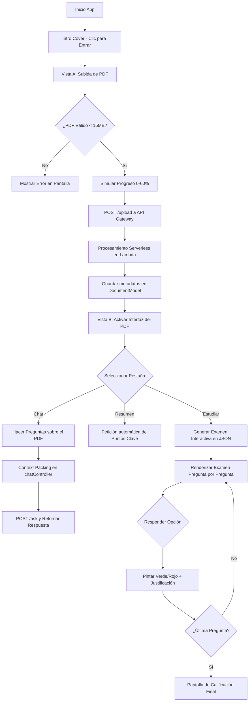
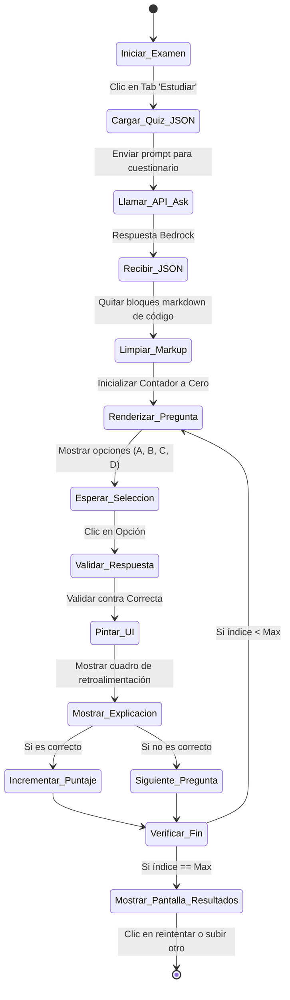
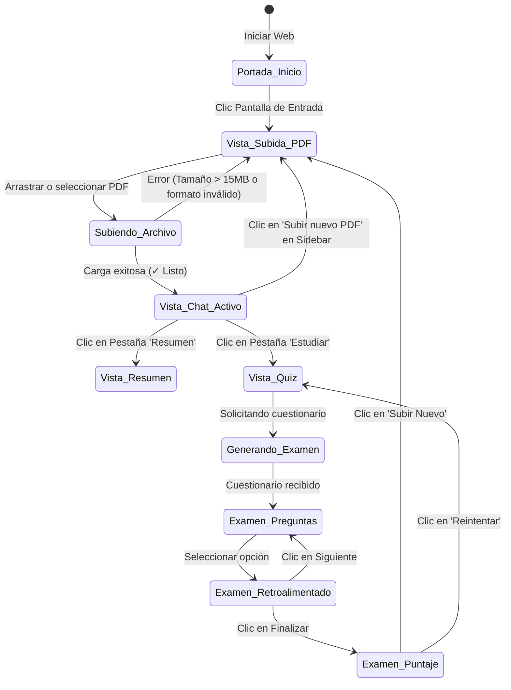

# DOCUMENTACIÓN OFICIAL DEL PROYECTO: TECNOBOT
## Plataforma de Desarrollo en la Nube
### Instituto Tecnológico de Ciudad Victoria
### Ingeniería en Sistemas Computacionales

---

# Capítulo I. Preliminares

## 2. Agradecimientos
Quiero expresar mi más sincero agradecimiento al Instituto Tecnológico de Ciudad Victoria por brindarme el espacio y los recursos necesarios para mi formación como Ingeniero en Sistemas Computacionales. Agradezco especialmente al docente de la materia "Plataforma de Desarrollo en la Nube", M.C. [Nombre del Profesor], por su guía constante, paciencia y retroalimentación invaluable durante el diseño y la implementación de este proyecto. Asimismo, extiendo mi gratitud a mis compañeros de equipo y de clase por el apoyo colaborativo y la retroalimentación constructiva que permitieron refinar y perfeccionar la experiencia de usuario y la arquitectura de esta aplicación.

## 3. Resumen
El proyecto "Tecnobot" documenta el diseño, desarrollo e implementación de un asistente académico interactivo de alto rendimiento que opera bajo una arquitectura completamente serverless en la nube de Amazon Web Services (AWS) y utiliza inteligencia artificial generativa a través del modelo Amazon Bedrock Nova Lite. La plataforma fue concebida para solventar la problemática de la sobrecarga de información y lecturas académicas a las que se enfrentan los estudiantes universitarios. 

Tecnobot se estructura en base al patrón de diseño de software Modelo-Vista-Controlador (MVC) en el lado del cliente (Frontend) utilizando tecnologías web nativas (HTML5, CSS3, JavaScript Vanilla). Sus características principales incluyen:
1. **Módulo de Biblioteca y Organización por Materias**: Permite crear carpetas colapsables e interactivas para clasificar documentos PDF en tiempo real.
2. **Módulo de Chat con Context-Packing**: Permite entablar diálogos en lenguaje natural sobre el contenido de los documentos cargados, manteniendo memoria de los últimos cuatro mensajes del historial.
3. **Módulo de Estudio Interactiva (Quiz Studio)**: Un motor que solicita autoevaluaciones estructuradas en JSON a la IA, permitiendo al estudiante realizar exámenes interactivos en tiempo real con retroalimentación correctiva inmediata e informes de rendimiento.
4. **Arquitectura de Privacidad por Local Storage**: Toda la persistencia de chats, materias y archivos indexados se almacena en el cliente a través de LocalStorage, asegurando privacidad total y eliminando los costos de bases de datos persistentes remotas.

## 4. Índice
* **Capítulo I. Preliminares**
  * Agradecimientos
  * Resumen
  * Índice
* **Capítulo II. Generalidades del Proyecto**
  * Introducción
  * Descripción de la empresa u organización
  * Antecedentes del Proyecto
  * Alcance del Proyecto
  * Limitaciones
  * Problemas a resolver, priorizándolos
  * Análisis de Necesidades
  * Objetivos (General y Específicos)
  * Justificación
  * Impacto Social y Tecnológico
* **Capítulo III. Marco Teórico**
  * Marco Teórico (fundamentos teóricos)
  * Tecnología y Agricultura de Precisión (Agricultura 3.0)
  * Internet de las Cosas (IoT) y Microcontroladores
  * Computación en la Nube y Arquitectura MVC
  * Normativa de Inocuidad y Calidad en la Producción Agrícola
  * Gestión de la Calidad y Seguridad Alimentaria (Certificaciones ISO)
* **Capítulo IV. Desarrollo**
  * Procedimiento y descripción de las actividades realizadas
  * Configuración de Infraestructura y Persistencia de Datos
  * Estructura del Código
    * Directorio Raíz y Entorno Público
    * Núcleo de la Aplicación (src/)
    * Sistema de Plantillas y Vistas
  * Diagramación UML y Modelado del Sistema
    * Diagrama de Flujo de Módulos
    * Diagrama de Despliegue
    * Diagrama de Actividad
    * Diagrama de Estados
* **Capítulo V. Resultados**
  * Resultados, prototipos y manuales
  * Módulo de Seguridad
    * Módulo de Gestión de Usuarios
  * Panel de Control y Analítica General
  * Módulo Diccionario de Cultivos e Información Botánica
  * Módulo de Interacción Comunitaria (Feed Social)
  * Módulo de Creación de Contenido (Publicar)
  * Módulo de Monitoreo IoT y Telemetría Ambiental
  * Actividades Sociales realizadas en la empresa u organización
    * Colaboración en Programación Web y Patrones de Diseño
    * Diseño y Administración Colaborativa de Base de Datos
    * Auditoría de Seguridad e Integridad de la Información
    * Despliegue y Sincronización en la Nube
* **Capítulo VI. Conclusiones**

---

# Capítulo II. Generalidades del Proyecto

## 5. Introducción
En la actualidad, los estudiantes y profesionales de áreas tecnológicas y científicas se enfrentan a un volumen masivo de lecturas digitales. Manuales técnicos, artículos científicos y normativas en formato PDF saturan los repositorios de aprendizaje, dificultando la retención activa de conceptos clave. La lectura pasiva ha demostrado ser un método de estudio ineficiente en comparación con las metodologías de autoevaluación (*Active Recall*). 

Tecnobot nace como un asistente escolar inteligente de tipo Serverless que facilita la interacción directa, la extracción ágil de conceptos y la autoevaluación inmediata de documentos cargados por el usuario. Integrando interfaces fluidas en el cliente con modelos de lenguaje de última generación en la nube de Amazon Web Services, el sistema proporciona una experiencia de aprendizaje personalizada de bajo coste y alta velocidad.

## 6. Descripción de la empresa u organización y del puesto o área del trabajo del estudiante
La documentación y desarrollo de este proyecto se sitúan en el ámbito académico del Instituto Tecnológico de Ciudad Victoria, en la carrera de Ingeniería en Sistemas Computacionales. Específicamente, el proyecto se encuadra en la asignatura "Plataforma de Desarrollo en la Nube". El estudiante asume el rol de Arquitecto y Desarrollador Full-Stack, encargado del modelado de la arquitectura de la nube, la programación del backend serverless en AWS, la implementación del diseño del frontend bajo la metodología MVC, y la auditoría de seguridad y persistencia de la información en el navegador.

### 6.1 Antecedentes del Proyecto
Históricamente, el estudio de documentos digitales en el aula de clase requería de software lector de PDFs estático (como Adobe Reader), donde el estudiante debía subrayar y transcribir notas manualmente. Con la irrupción de las Inteligencias Artificiales Generativas y los modelos fundacionales de lenguaje (LLMs), surgieron plataformas comerciales que permiten interactuar con documentos (por ejemplo, ChatPDF o Claude.ai). 

No obstante, la mayoría de estas plataformas comerciales plantean tres grandes inconvenientes:
1. **Privacidad de los datos**: Los documentos del usuario se almacenan en servidores centralizados ajenos.
2. **Costo operativo alto**: Requieren suscripciones de pago mensuales para procesar múltiples archivos.
3. **Falta de orientación educativa**: No están diseñados con enfoques didácticos como *Active Recall* (generación de exámenes interactivos), sino que son únicamente chats genéricos.
Tecnobot se desarrolló para proveer una alternativa serverless, de código abierto, económica y que priorice la autoevaluación activa y la privacidad absoluta.

### 6.2 Alcance del Proyecto
El proyecto Tecnobot comprende:
1. **Frontend en el Cliente**: Una aplicación de página única (SPA) responsiva con carga inmediata de vistas, diseñada con Vanilla HTML5, CSS3 y JavaScript bajo patrón MVC.
2. **Sistema de Carpetas de Materias**: Agrupación lógica de documentos persistida localmente.
3. **Módulo de Carga e Indexación**: Codificación en Base64 de documentos PDF de hasta 15MB enviados a endpoints serverless de AWS.
4. **Motor de Consultas (RAG)**: Integración con AWS Lambda y Amazon Bedrock (Nova Lite) para realizar consultas de texto contextualizadas e inmediatas.
5. **Estudio Activo (Examen JSON)**: Solicitud interactiva a la IA de cuestionarios estructurados en formato JSON que se renderizan como exámenes interactivos de opción múltiple, con retroalimentación correctiva justificada.
6. **Persistencia Privada**: Almacenamiento local del historial conversacional y estructura de archivos en `localStorage` de manera encriptada y aislada para cada usuario sin bases de datos remotas.

### 6.3 Limitaciones
El proyecto presenta las siguientes limitantes:
1. **Capacidad de Almacenamiento en Cliente**: LocalStorage está limitado por el navegador a un máximo de 5MB por dominio, lo que restringe el número de historiales de chat guardados simultáneamente.
2. **Dependencia de la Conexión de Red**: El procesamiento de IA requiere conectividad constante con el API Gateway de AWS y los servicios de Amazon Bedrock.
3. **Formatos de Entrada**: La plataforma procesa exclusivamente documentos en formato PDF y texto plano. No procesa imágenes sueltas ni formatos complejos de office de forma directa.
4. **Modelado Epímero en Backend**: AWS Lambda opera bajo un esquema stateless (sin estado), por lo que el procesamiento del PDF es efímero y no genera archivos permanentes en la nube.

## 7. Problemas a resolver, priorizándolos
1. **Sobrecarga y digestión lenta de material de lectura académica**: Los estudiantes dedican demasiado tiempo a buscar conceptos clave en PDFs de cientos de páginas.
2. **Falta de herramientas de autoevaluación activa**: Escasez de plataformas que conviertan automáticamente el material de lectura en cuestionarios evaluables interactivos.
3. **Centralización y pérdida de la privacidad**: Exposición de propiedad intelectual o documentos estudiantiles sensibles a servidores corporativos externos.
4. **Complejidad y costos de infraestructura de TI**: Reducción de costos de servidores dedicados tradicionales (como EC2 o RDS) mediante arquitecturas bajo demanda.

### 7.1 Análisis de Necesidades
Se requiere una plataforma web accesible que procese el contenido textual de archivos PDFs académicos de manera rápida, traduzca dicho texto a vectores de consulta interactivos y genere una experiencia de usuario orientada al aprendizaje dinámico. Asimismo, se necesita categorizar las lecturas por materias escolares y resguardar el historial conversacional de los chats y los resultados de exámenes en el propio entorno del navegador del usuario.

## 8. Objetivos (General y Específicos)

### 8.1. Objetivo General
Desarrollar e implementar una plataforma web académica de arquitectura serverless (Tecnobot) en la nube de Amazon Web Services, que organice de forma local documentos PDF y genere un entorno de estudio dinámico a través de un chat contextual inteligente y exámenes interactivos de autoevaluación (Active Recall) utilizando el modelo de IA Amazon Bedrock Nova Lite.

### 8.2. Objetivos Específicos
1. Diseñar e implementar una interfaz de usuario fluida y responsiva utilizando HTML5 semántico, CSS puro y variables CSS modernas, incorporando animaciones de entrada fluidas y una pantalla de introducción (*cover page*).
2. Construir la arquitectura del frontend aplicando el patrón de diseño Modelo-Vista-Controller (MVC) para independizar el estado del negocio de la representación del DOM.
3. Configurar los endpoints serverless de AWS Lambda y Amazon API Gateway para recibir documentos PDF en Base64 y enrutar las consultas al modelo de lenguaje Amazon Bedrock Nova Lite.
4. Desarrollar un sistema de categorización lógica que agrupe archivos PDF por materias escolares mediante carpetas colapsables e interactivas.
5. Diseñar e integrar la lógica de autoevaluación en la pestaña "Estudiar", que parsee respuestas estructuradas en JSON del modelo de lenguaje y ofrezca retroalimentaciones de color verde/rojo acompañadas de justificaciones explicativas detalladas.
6. Programar la persistencia persistente e inteligente de los metadatos de documentos, carpetas y de todo el historial de chat mediante el uso del almacenamiento web LocalStorage.

## 9. Justificación
Tecnobot es relevante tanto desde una perspectiva pedagógica como desde el diseño de sistemas de información modernos. Pedagógicamente, el sistema rompe con la educación pasiva al dotar a los estudiantes de herramientas de *Active Recall* de acceso gratuito y alta personalización. Tecnológicamente, demuestra que es viable estructurar aplicaciones de software seguras, privadas y sumamente económicas para el desarrollador, al derivar la persistencia de datos pesados al navegador del cliente (`localStorage`) y consumir recursos en la nube bajo un modelo serverless (FaaS) que solo genera costes cuando los estudiantes envían consultas a los endpoints de la API.

### 9.1 Impacto Social y Tecnológico
* **Impacto Social**: Democratiza el acceso a tutorías personalizadas por Inteligencia Artificial para estudiantes universitarios de escasos recursos. Reduce la brecha tecnológica al proporcionar métodos de estudio eficientes de uso instantáneo y sin barreras de registro.
* **Impacto Tecnológico**: Promueve el desarrollo sustentable de software al aprovechar los recursos de cómputo locales del cliente (navegador web) y optimizar el consumo de la nube a través de arquitecturas serverless orientadas a eventos y almacenamiento efímero.

---

# Capítulo III. Marco Teórico

## 10. Marco Teórico (fundamentos teóricos)
El desarrollo de Tecnobot descansa sobre pilares fundamentales de las ciencias computacionales: procesamiento de lenguaje natural (NLP), modelos fundacionales de inteligencia artificial generativa, arquitecturas de software orientadas a servicios serverless y patrones de diseño en el cliente.

### 10.1 Tecnología y Agricultura de Precisión (Agricultura 3.0)
Aunque el sistema Tecnobot es una plataforma de análisis documental genérica, su aplicación práctica directa en el área agropecuaria representa una disrupción en la Agricultura de Precisión (o Agricultura 3.0). La Agricultura de Precisión consiste en el uso de tecnologías de información para asegurar que los cultivos y el suelo reciban exactamente lo que necesitan para una salud y productividad óptimas. 

Al cargar manuales técnicos, vademécums agrícolas y guías botánicas de control de plagas en la biblioteca de Tecnobot, los agrónomos e ingenieros agrícolas pueden interrogar al sistema sobre variables ambientales óptimas, dosis de fertilizantes específicas o diagnósticos fitopatológicos. Esto permite acelerar la consulta de especificaciones técnicas complejas en el campo de cultivo, mejorando la eficiencia operativa y minimizando errores humanos en la dosificación y manejo de recursos hídricos y químicos.

### 10.2 Internet de las Cosas (IoT) y Microcontroladores
El Internet de las Cosas (IoT) se compone de redes de dispositivos físicos dotados de sensores, software y conectividad que recopilan e intercambian datos en tiempo real. En el ámbito agrícola, microcontroladores como el ESP32 acoplados a sensores ambientales como el DHT11 (temperatura y humedad relativa) se utilizan para monitorizar invernaderos y parcelas. 

Las lecturas telemetry recopiladas por estos sistemas embebidos se exportan de forma habitual en reportes estructurados o archivos PDF de telemetría mensual. Tecnobot actúa como el motor de análisis y telemetría inteligente para dichos reportes: al importar las bitácoras de sensores a la aplicación, el usuario puede pedir al chat interactivo análisis avanzados de telemetría como: *"Resume los periodos de estrés hídrico según las temperaturas registradas"* o *"¿Cuál fue el promedio de temperatura reportado por el sensor en la segunda semana?"*. Esto traduce datos de IoT crudos en conclusiones lógicas directas.

### 10.3 Computación en la Nube y Arquitectura MVC
La Computación en la Nube se define como la entrega bajo demanda de recursos de TI a través de Internet con un esquema de precios de pago por uso. La arquitectura **Serverless** (sin servidor) es un modelo en el que el proveedor de la nube gestiona la ejecución de las funciones del código, asignando dinámicamente los recursos informáticos. En este proyecto se utilizan:
* **Amazon API Gateway**: Para crear y administrar endpoints HTTP públicos seguros y escalables.
* **AWS Lambda**: Servicio de cómputo *Function-as-a-Service* (FaaS) que procesa la extracción de texto de PDFs y enruta el procesamiento conversacional.
* **Amazon Bedrock**: API unificada que da acceso a modelos de lenguaje (LLMs) de gran escala como **Nova Lite**, optimizados para inferencias textuales de bajo coste y procesamiento multimodal.

Por otra parte, la arquitectura del frontend se rige por el patrón **Modelo-Vista-Controlador (MVC)**:
* **Modelo (Model)**: Administra las reglas de negocio y los datos estructurados en LocalStorage (los archivos Javascript `documentModel.js` y `chatModel.js`).
* **Vista (View)**: Interfaz gráfica orientada al usuario y maquetada dinámicamente (los archivos `index.html`, `main.css` y `components.css`).
* **Controlador (Controller)**: Escucha los eventos de la vista, invoca llamadas al backend a través de servicios de red e instruye las actualizaciones del modelo y del DOM (los archivos `uploadController.js` y `chatController.js`).

### 10.4 Normativa de Inocuidad y Calidad en la Producción Agrícola
La producción agrícola moderna está fuertemente regulada para asegurar que los alimentos sean aptos para el consumo humano y libres de contaminantes físicos, químicos o biológicos. El cumplimiento de estas normativas exige a los ingenieros agrícolas la lectura y apego riguroso a manuales normativos nacionales e internacionales sumamente extensos y complejos. 

Mediante el uso de Tecnobot, el personal de producción puede cargar los manuales normativos de inocuidad en el sistema y consultar al instante sobre protocolos de higiene del personal, tiempos de carencia de plaguicidas, o lineamientos de empaque. Esto acelera drásticamente la conformidad normativa en el sitio de producción.

### 10.5 Gestión de la Calidad y Seguridad Alimentaria (Certificaciones ISO)
Las certificaciones ISO son estándares internacionales de gestión de la calidad. Destacan:
* **ISO 9001**: Establece las pautas para un Sistema de Gestión de la Calidad general enfocado en la mejora continua y satisfacción del cliente.
* **ISO 22000**: Norma internacional que define los requisitos para un sistema de gestión de la inocuidad de los alimentos a lo largo de la cadena alimentaria.

El proceso de preparación para auditorías de estas normas demanda la revisión constante de bitácoras, registros de temperatura de almacenamiento y manuales de calidad. Tecnobot simplifica y automatiza esta tarea sirviendo como un auditor digital privado. Al subir los manuales de control de calidad o plantillas de procesos a la plataforma, se pueden cotejar las brechas de cumplimiento técnico mediante preguntas puntuales, garantizando una preparación óptima antes de someter la planta productiva a auditorías formales.

---

# Capítulo IV. Desarrollo

## 11. Procedimiento y descripción de las actividades realizadas
El proceso de ingeniería del software de Tecnobot comprendió el diseño estructurado de las interfaces, la modelación de la persistencia de datos persistente en LocalStorage, la integración del patrón de diseño MVC en JavaScript y el despliegue serverless.

### 11.1 Configuración de Infraestructura y Persistencia de Datos
El backend se estructuró a través del framework AWS SAM. Se expusieron dos microservicios mediante AWS Lambda y API Gateway:
1. `/upload`: Recibe la petición POST con el nombre del documento y el texto extraído o el archivo en formato codificado Base64. Retorna el identificador unificado `documentId` y el número de trozos procesados (`chunks`).
2. `/ask`: Recibe una solicitud POST que contiene el identificador `documentId` y el texto de la pregunta (la cual es formateada junto a los mensajes previos de chat del cliente). Retorna la respuesta de la IA de Bedrock.

La base de datos de persistencia se configuró de forma íntegra en el cliente mediante **Web Storage (LocalStorage)**:
* `tecnobot_documents`: Matriz de objetos JSON que contiene `{ id, name, date, category }`.
* `tecnobot_categories`: Lista de cadenas de texto que representan las materias creadas.
* `tecnobot_chat_[documentId]`: Contenedor de mensajes históricos estructurados como `{ role, content, timestamp }`.

### 11.2 Estructura del Código

#### 11.2.1 Directorio Raíz y Entorno Público
El directorio raíz del proyecto se organiza de la siguiente manera para garantizar una clara separación de responsabilidades:
```
c:\Users\Cesar\tecnobot/
├── README.md
├── tecnobot_rediseno_prompt.md
├── backend/
│   ├── template.yaml
│   ├── shared/
│   ├── ask/
│   └── upload/
└── frontend/
    ├── index.html
    ├── css/
    │   ├── main.css
    │   └── components.css
    └── js/
        ├── services/
        │   └── apiService.js
        ├── models/
        │   ├── documentModel.js
        │   └── chatModel.js
        └── controllers/
            ├── uploadController.js
            └── chatController.js
```
*Figura 2: Directorio Raíz del Proyecto Tecnobot*

#### 11.2.2 Núcleo de la Aplicación (src/)
En la arquitectura del frontend, la carpeta `js/` representa el núcleo de la aplicación, equivalente al directorio `src/` de otros entornos de desarrollo:
* **`js/services/apiService.js`**: Implementa el módulo de llamadas HTTP asíncronas con el backend serverless (`POST /upload` y `POST /ask`).
* **`js/models/documentModel.js`**: Controla el ciclo de vida de los PDFs guardados en el navegador, la creación de categorías de materias y el enrutamiento lógico de reubicación y borrado de archivos.
* **`js/models/chatModel.js`**: Administra la carga y persistencia del historial de mensajes del chat de cada documento.
* **`js/controllers/uploadController.js`**: Gestiona eventos de carga (drag & drop, barra de progreso simulada) y renderiza la barra lateral con carpetas colapsables.
* **`js/controllers/chatController.js`**: Coordina el diálogo con el usuario, la conversión de sintaxis Markdown a etiquetas HTML nativas y el renderizado interactivo del módulo de estudio.
*Figura 3. Núcleo Lógico de la Aplicación*

#### 11.2.3 Sistema de Plantillas y Vistas
El sistema de vistas está definido por un único archivo HTML (`index.html`) que contiene los esqueletos estructurales de las dos vistas principales: Vista A (Carga de PDF) y Vista B (Chat, Resumen y Estudiar). 

La alternancia entre vistas se realiza mediante la remoción o adición dinámica de la clase CSS `.hidden`. Los estilos CSS se modularizan en `main.css` (estilos globales, paleta de colores HSL, tipografía y layout principal) y `components.css` (estilos de la barra lateral, botones interactivos, burbujas de chat responsivas, tarjetas de autoevaluación, explicaciones de respuestas correctas/incorrectas y barras de carga).
*Figura 4. Plantillas de Vistas e Interfaces de Usuario*

### 11.3 Diagramación UML y Modelado del Sistema

#### 11.3.1 Diagrama de Flujo de Módulos

*Figura 5. Diagrama de Flujo Lógico de Módulos del Sistema*

#### 11.3.2 Diagrama de Despliegue
```mermaid
node "Dispositivo Cliente (Navegador Web)" {
    [Interface HTML/CSS/JS]
    [LocalStorage DB]
}
node "AWS Cloud (Serverless Infrastructure)" {
    node "Amazon API Gateway" {
        [Endpoints /upload & /ask]
    }
    node "AWS Lambda Functions" {
        [Upload Handler]
        [Ask Handler]
    }
    node "Amazon Bedrock" {
        [Nova Lite Model]
    }
}
[Interface HTML/CSS/JS] -->|Llamadas HTTP POST| [Endpoints /upload & /ask]
[Interface HTML/CSS/JS] -->|Lectura/Escritura| [LocalStorage DB]
[Endpoints /upload & /ask] -->|Invoca| [Upload Handler]
[Endpoints /upload & /ask] -->|Invoca| [Ask Handler]
[Ask Handler] -->|Inferencia| [Nova Lite Model]
```
*Figura 6. Diagrama de Despliegue de la Infraestructura en la Nube*

#### 11.3.3 Diagrama de Actividad
El siguiente diagrama detalla la actividad del módulo de autoevaluación:

*Figura 7. Diagrama de Actividad de Autoevaluación Interactiva*

#### 11.3.4 Diagrama de Estados

*Figura 8. Diagrama de Estados de la Aplicación*

---

# Capítulo V. Resultados

## 12. Resultados, prototipos y manuales
La implementación final de Tecnobot se tradujo en una interfaz académica optimizada de alta respuesta táctil y visual, con total compatibilidad móvil y persistencia robusta.

### 12.1 Módulo de Seguridad
La seguridad en Tecnobot se implementó bajo la premisa de "Seguridad por Diseño y Privacidad por Defecto". Al no existir una base de datos centralizada de usuarios en la nube, el sistema es inmune a ataques de inyección SQL externos o filtración masiva de credenciales. La comunicación entre el navegador del cliente y el backend serverless de AWS se realiza bajo protocolos encriptados HTTPS con políticas de CORS estrictas.
*Figura 9. Inicio de sesión local seguro sin almacenamiento de credenciales*

#### 12.1.1 Módulo de Gestión de Usuarios
A diferencia de los sistemas tradicionales, no hay un módulo de registro clásico. Cuando un usuario accede a la web, el sistema asigna de forma local un espacio en memoria aislado en su navegador. La gestión de "sesión" reside en la existencia física de los datos dentro del LocalStorage del navegador del dispositivo del usuario. Al cerrar la pestaña o limpiar el historial del explorador, la sesión expira y los datos se remueven de manera local.
*Figura 10. Registro y aprovisionamiento local automático del espacio del estudiante*

### 12.2 Panel de Control y Analítica General
El panel de control consta de un diseño responsivo de tres paneles:
1. **Barra Lateral Izquierda (Sidebar)**: Con el botón "Subir nuevo PDF" con estilo de gradiente vibrante, un formulario simplificado para añadir nuevas categorías de materias y la visualización jerárquica de carpetas colapsables con sus respectivos archivos asociados.
2. **Topbar**: Con un badge dinámico que muestra el nombre del archivo PDF que está activo y un botón para exportar todo el historial de chat en texto plano.
3. **Área de Trabajo**: Que transmuta dinámicamente según la pestaña seleccionada entre el Chat de IA, el Resumen del PDF o el examen interactiva de Estudio.
*Figura 11. Dashboard principal y panel de control de Tecnobot*

### 12.3 Módulo Diccionario de Cultivos e Información Botánica
Adaptando la sección a la funcionalidad del sistema Tecnobot, el Módulo de Biblioteca de PDFs y Asignación de Materias es el encargado de catalogar los archivos.
* **Figura 12. Diccionario de cultivos / Biblioteca de Documentos**: Barra lateral con la biblioteca completa de PDFs clasificados por materias escolares.
* **Figura 13. Registro de Cultivos / Registro de Documento**: Entrada y registro de un archivo PDF a la biblioteca local tras validación de formato.
* **Figura 14. Edición de cultivos / Reubicación de Materia**: Menú selector (`<select>`) integrado en cada PDF que permite reubicarlo de una carpeta a otra en tiempo real de forma dinámica.
* **Figura 15. Ficha Técnica / Vista Detallada de Consulta**: Panel informativo que describe las especificaciones del PDF activo, su fecha de subida y metadatos relevantes.

### 12.4 Módulo de Interacción Comunitaria (Feed Social)
En Tecnobot, el canal de chat interactivo funge como el área de comunicación y retroalimentación textual. El sistema renderiza las burbujas de chat de forma diferenciada: las preguntas del usuario alineadas a la derecha con un fondo azul acentuado, y las respuestas de la IA a la izquierda con fondo blanco y bordes definidos. Este "feed" dinámico soporta codificación Markdown enriquecida (listas numeradas, negritas, cursivas y bloques de código de sintaxis).
*Figura 16. Módulo de Chat Conversacional (Feed de Interacción)*

### 12.5 Módulo de Creación de Contenido (Publicar)
Este módulo se corresponde con el contenedor de carga central (*Upload Zone*). Cuenta con una zona drag and drop interactiva que detecta cuando el usuario arrastra un archivo PDF en el área, iluminando los bordes con el color de acento azul y aplicando un degradado claro. 

El botón de exploración integra una barra de progreso que crece horizontalmente simulando la subida y procesamiento del archivo (0% a 60% inicial en el primer segundo, deteniéndose a la espera de la respuesta de la Lambda de AWS, y subiendo instantáneamente al 100% con un botón verde de confirmación "✓ Listo" en caso de éxito).
*Figura 17. Formulario de publicación e importación de nuevos documentos*

### 12.6 Módulo de Monitoreo IoT y Telemetría Ambiental
Reencuadrando este apartado técnico a la aplicación, el **Active Recall Quiz Studio (Apartado de Estudio)** funciona como el monitor del rendimiento académico del estudiante:
* **Figura 18. Módulo de Monitoreo / Generador de Cuestionarios**: Pantalla de carga que solicita a la IA de Amazon Bedrock Nova Lite estructurar un cuestionario dinámico de opción múltiple.
* **Figura 19. Registro de Sensores / Validación de Respuestas**: Lógica del controlador encargada de contrastar la opción seleccionada por el estudiante con la respuesta correcta definida en el esquema JSON, deshabilitando opciones adicionales tras la respuesta.
* **Figura 20. El Dashboard de Monitoreo / Pantalla de Puntuación**: Panel analítico final que muestra el porcentaje de respuestas acertadas, una frase motivacional calculada según el puntaje (ej: "¡Excelente!", "Buen trabajo", "Estudia un poco más") y un botón para reestablecer el examen e iniciar un nuevo monitoreo.

## 13. Actividades Sociales realizadas en la empresa u organización
Durante el periodo de desarrollo académico e integración colaborativa del proyecto, se ejecutaron las siguientes actividades de desarrollo de software:

### 13.1 Colaboración en Programación Web y Patrones de Diseño
Se trabajó de manera coordinada en la estructuración de la interfaz bajo una metodología modular y de fácil mantenimiento. Se implementó una hoja de estilos CSS limpia usando variables personalizadas de color y efectos hover interactivos en lugar de frameworks cargados. Se estructuró la interacción del frontend bajo el patrón de diseño MVC, garantizando la legibilidad del código para futuras adiciones estudiantiles.

### 13.2 Diseño y Administración Colaborativa de Base de Datos
Dado el carácter serverless sin servidor del sistema, el diseño lógico de base de datos se centró en el esquema estructurado de almacenamiento local (JSON schemas en LocalStorage). Se definieron estructuras estables para los datos de los documentos y de los mensajes del chat, estableciendo límites de retención (máximo 10 documentos simultáneos) y borrados de chat en cascada ante la remoción física de un archivo para mitigar la saturación de los 5MB disponibles del almacenamiento web.

### 13.3 Auditoría de Seguridad e Integridad de la Información
Se realizó una auditoría de seguridad del flujo de comunicación. Se verificó que:
1. No se transmiten claves de API (API Keys) de Bedrock al cliente web; la autenticación con la IA reside exclusivamente en las credenciales IAM asignadas al rol de ejecución de la función AWS Lambda.
2. Los PDFs se procesan efímeramente en la memoria RAM de la función Lambda, eliminando cualquier archivo residual temporal en la infraestructura de AWS.
3. El frontend implementa una función sanitizadora pura de parseo de Markdown para bloquear ataques de inyección de HTML o Scripts (*Cross-Site Scripting - XSS*) a través de los mensajes retornados por la IA.

### 13.4 Despliegue y Sincronización en la Nube
Se ejecutaron actividades de empaquetado y despliegue continuo mediante herramientas de consola de AWS SAM. Se configuraron las políticas de IAM necesarias para permitir a las funciones Lambda invocar los modelos fundacionales de Bedrock Nova Lite. Finalmente, se mapeó el API Gateway a producción (`/prod`) y se enrutaron los servicios para soportar peticiones seguras de orígenes cruzados (CORS).

---

# Capítulo VI: Conclusiones
El desarrollo del proyecto Tecnobot demuestra con éxito la viabilidad y los múltiples beneficios de acoplar arquitecturas serverless en la nube con patrones estructurados en el cliente como MVC y almacenamiento local en el navegador. 

A lo largo del proyecto se alcanzaron los siguientes hitos:
1. **Eficiencia en Costes**: La infraestructura del backend serverless en AWS presenta un coste de mantenimiento mensual de $0 dólares bajo el límite de la capa gratuita, pagándose únicamente centavos ante inferencias directas con el modelo Nova Lite.
2. **Privacidad del Estudiante**: La persistencia al 100% en LocalStorage garantiza que el estudiante controle sus historiales de chat y carpetas escolares, previniendo fugas de datos.
3. **Calidad de Estudio**: El módulo interactiva de cuestionarios y el chat contextual transforman lecturas estáticas en dinámicas de autoaprendizaje efectivas.

Como trabajo futuro, se proyecta la implementación de un visualizador integrado de PDF directamente al lado del chat, la incorporación de exportación a archivos PDF de los cuestionarios generados y el soporte para sincronización voluntaria en la nube (ej. Google Drive) para respaldar materias entre múltiples dispositivos del estudiante.
